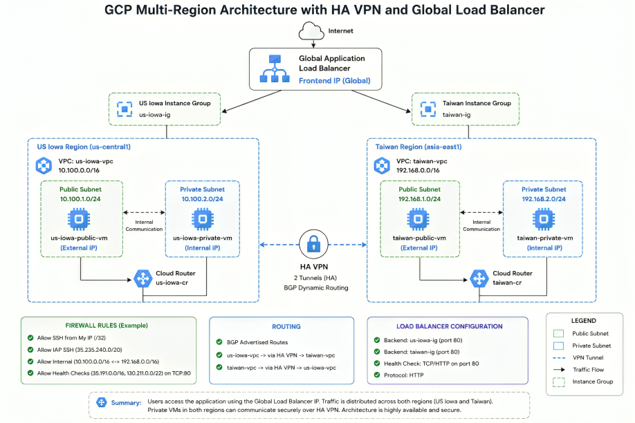
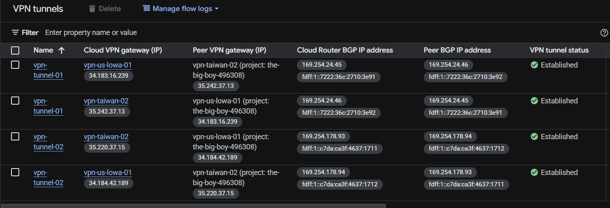
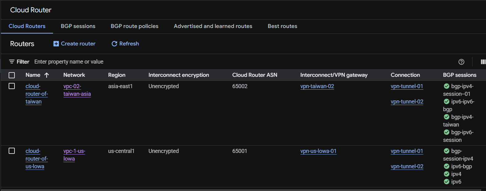
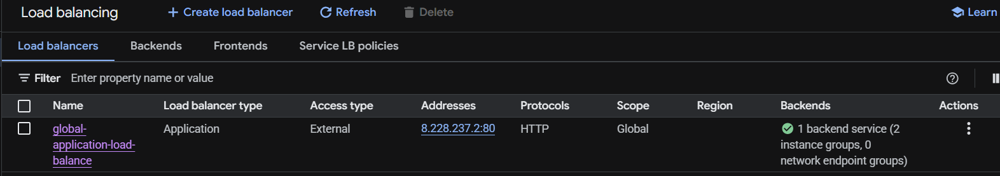
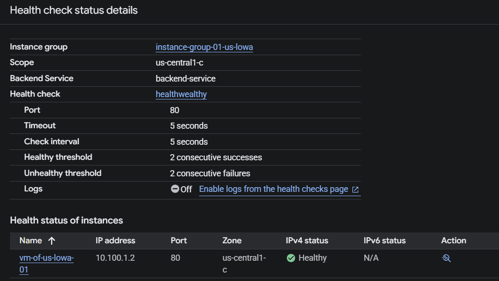
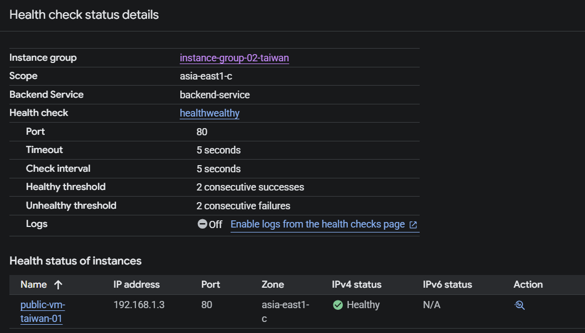
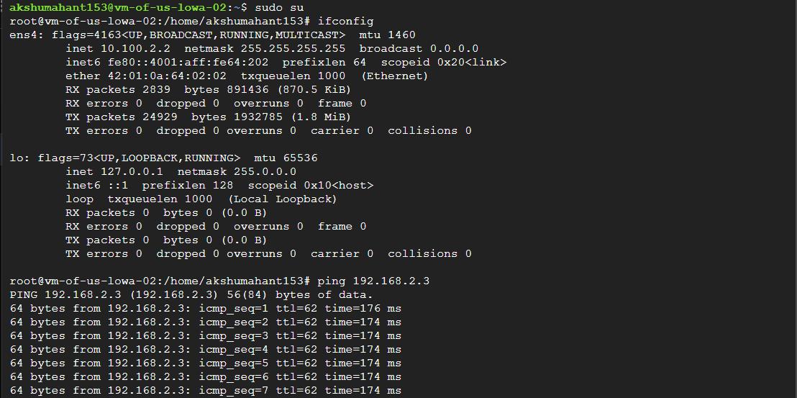
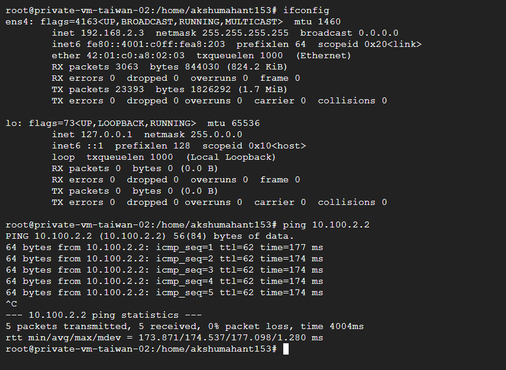

# GCP Multi-Region Architecture with HA VPN and Global Load Balancer

## Project Overview

This project demonstrates a highly available multi-region architecture on Google Cloud Platform (GCP) using:

- HA VPN
- Cloud Router
- BGP Dynamic Routing
- Global HTTP Load Balancer
- Multi-region VPC design
- Public and Private Subnets
- Firewall Rules
- Health Checks

The architecture securely connects two different regions:

- US Iowa (us-central1)
- Taiwan (asia-east1)

Traffic is distributed globally using a Global Application Load Balancer while private communication between regions happens securely over HA VPN tunnels using BGP routing.

---

# Architecture Diagram

---

# Technologies Used

- Google Cloud Platform (GCP)
- HA VPN
- Cloud Router
- BGP
- Global HTTP Load Balancer
- Compute Engine
- VPC Networks
- Firewall Rules

---

# Network Architecture

## US Iowa Region

### VPC
- vpc-1-us-lowa

### Subnets
- Public Subnet: 10.100.1.0/24
- Private Subnet: 10.100.2.0/24

---

## Taiwan Region

### VPC
- vpc-02-taiwan-asia

### Subnets
- Public Subnet: 192.168.1.0/24
- Private Subnet: 192.168.2.0/24

---

# HA VPN Configuration

## VPN Tunnels
- vpn-tunnel-01
- vpn-tunnel-02

## Routing
- Dynamic Routing using BGP
- Cloud Router configured in both regions

---

# Load Balancer Configuration

- Type: Global Application Load Balancer
- Protocol: HTTP
- Backend Instance Groups:
  - US Iowa Instance Group
  - Taiwan Instance Group

---

# Firewall Rules

Allowed:
- SSH (TCP 22)
- HTTP (TCP 80)
- ICMP

---

# Connectivity Validation

## Successful Ping Test
- US private VM → Taiwan private VM
- Taiwan private VM → US private VM

## Health Checks
- Backend instances are healthy
- Port 80 enabled

---

# Screenshots

## VPN Tunnel Status

## Cloud Router

## Load Balancer

## Health Check US

## Health Check Taiwan

## Ping Test from US Iowa to Taiwan

This test confirms successful private communication from the US Iowa private VM to the Taiwan private VM over HA VPN using BGP dynamic routing.

---

## Ping Test from Taiwan to US Iowa

This test confirms successful bidirectional connectivity between both regions through secure VPN tunnels.

---

# Project Outcome

This project successfully demonstrates:

- Multi-region connectivity
- High availability architecture
- Secure inter-region communication
- Dynamic routing using BGP
- Global traffic distribution using Load Balancer

---

# Author

Akshay Mahant
